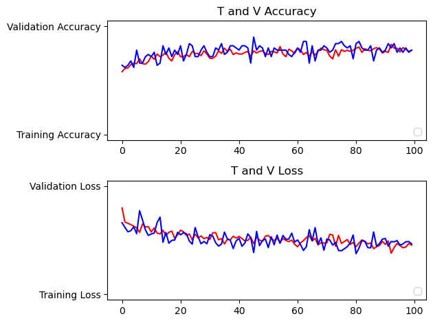
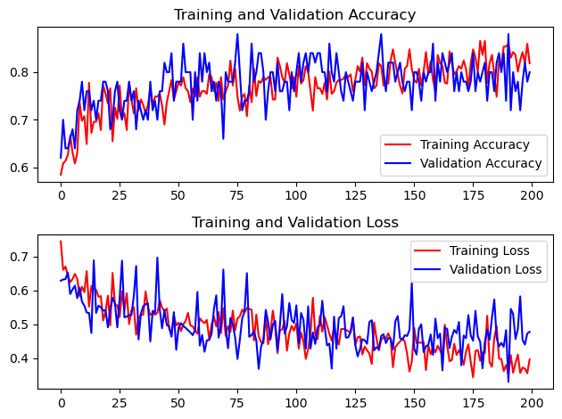

# Brain Tumor Detection

A lot of things are to be done. Currently I have ~9secs per epochs, I'm suspicious of such low value.

- [ ] Check if we get better or worse time per epochs if the dataset is split manually
- [ ] Modularize Code
- [ ] Experiment with layers in the `cnn`

## Some results

### Data for 30 epochs

### Data for 100 epochs

### Data for 200 epochs

