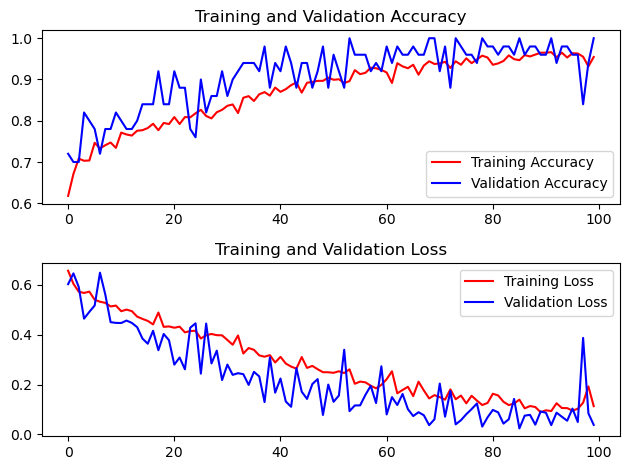

# Brain Tumor Detection

A lot of things are to be done. Currently I have ~9secs per epochs, I'm suspicious of such low value.

- [x] Check if we get better or worse time per epochs if the dataset is split manually
- [ ] Modularize Code
- [ ] Experiment with layers in the `cnn`
- [ ] make the temporary direct platform independent

|  |  |
|--------------------|--------------------|
|  |  |

## Dataset and Pretrained models

- [Dataset 1](https://www.kaggle.com/ahmedhamada0/brain-tumor-detection)
- [Dataset 2](https://www.kaggle.com/navoneel/brain-mri-images-for-brain-tumor-detection)
- [Pretrained Models](https://www.kaggle.com/gaborfodor/keras-pretrained-models)
