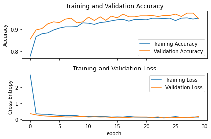

# Brain Tumor Detection

- [x] VGG16
- [ ] CNN
- [ ] ResNet50
- [x] make the temporary direct platform independent

# Results

## Dataset and Pretrained models

- [Dataset 1](https://www.kaggle.com/ahmedhamada0/brain-tumor-detection)
- [Dataset 2](https://www.kaggle.com/navoneel/brain-mri-images-for-brain-tumor-detection)
